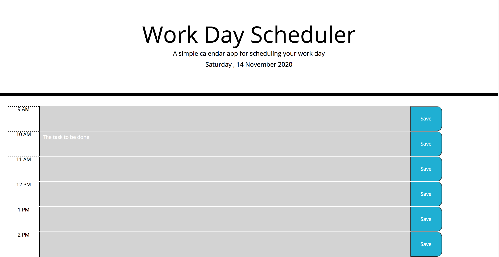
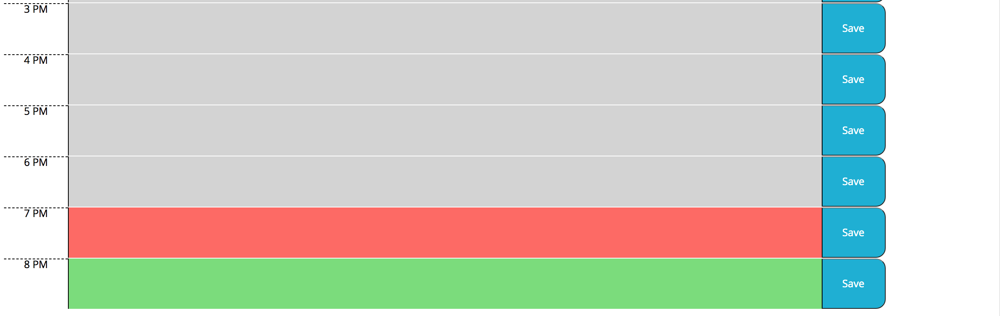

# Day Planner

## Introduction
A simple planner to keep track of your tasks for the day, hour by hour.

## How to Use
1. Type your task in the hour block you wish
2. Click save to save your task

## Design
* Time blocks change color depending on the current time. Past times are gray, the current time is red, and future times are green.
* Tasks are saved to local storage to save them in case the page is refreshed.
* Day.js is used for time management and manipulation
* Bootstrap elements for a responsive page  

## Files and Directory
* repo-name
    * screenshots
        * screen1.png
        * screen2.png
    * index.html
    * script.js        
    * style.css
    * README.md

## Link
[Link to Live Website](https://jesusefraingonzalez.github.io/day-planner)

## ScreenShots

## todo
* make elements more responsive
* styles